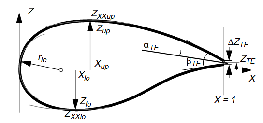
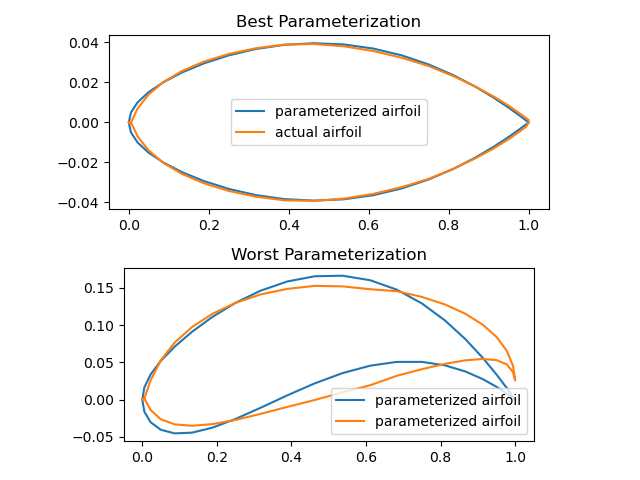
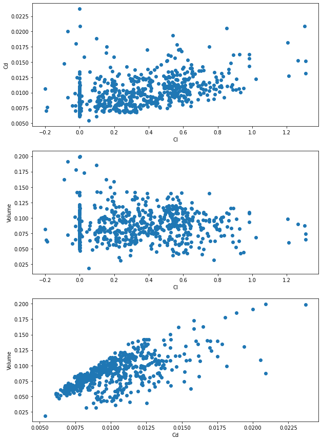
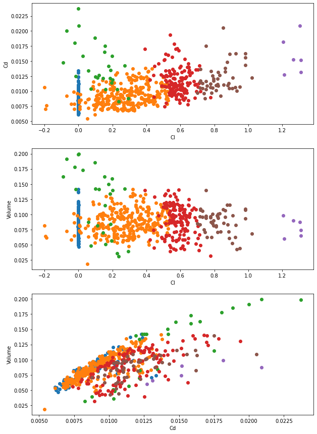
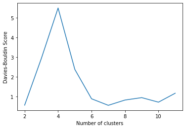
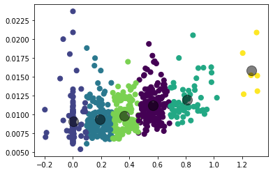
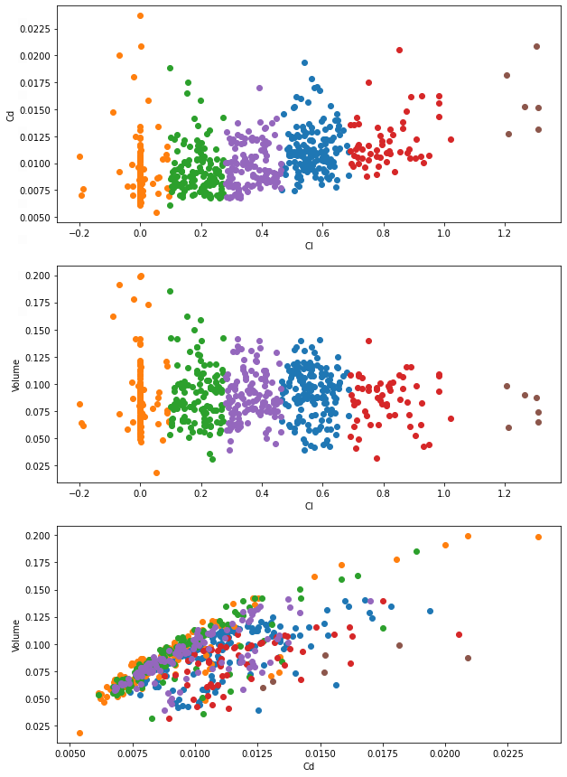
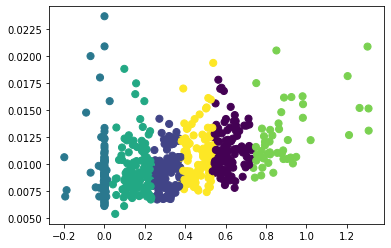
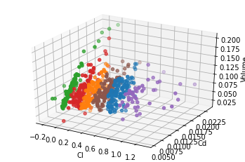
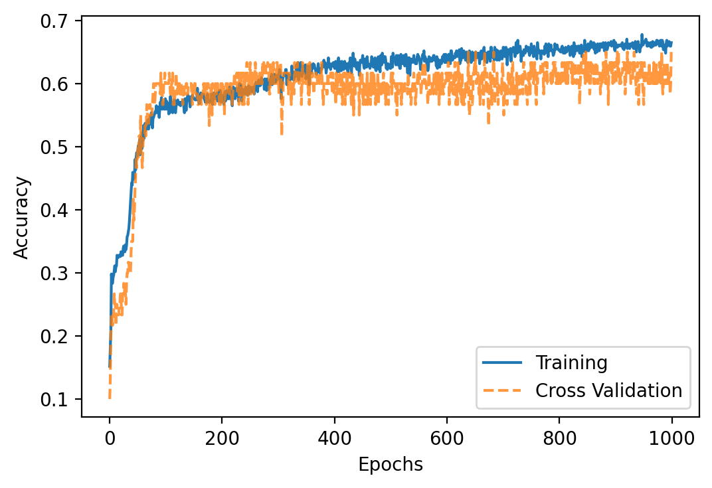

# Learning Frameworks for Various Airfoils

## I. Introduction
Although Computational Fluid Dynamics (CFD) surpasses experimental techniques in terms of time, cost and overall simplicity (this is attributed to the various complexities associated with the experimental setup), it is a nontrivial technique which necessitates significant amounts of computational cost to obtain accurate results (i.e. results comparable to those obtained using experimentation). Such factors prove to be sufficiently problematic during iterative design procedures. Dimensionality is one such issue associated with CFD. Though dimensionality may be addressed through altering coordinates from Cartesian to PARSEC parameters [1], the resulting shape may not be optimal. In particular, obtaining an optimal airfoil shape for given flight conditions is an arduous task. Such an optimization problem incorporates many factors, often times involving latent variables in the process, and may even lead itself to a multidisciplinary design optimization (MDO) problem. To this end, Machine Learning presents itself as the hero in disguise; we may leverage learning to curtail the time necessary to ascertain the aforementioned optimal airfoil properties. [2][3][4]

## II. Problem Statement 
The problem at hand is presented as follows; given a dataset with airfoil parameters (features) and corresponding aerodynamic performances (labels), clustering will be conducted, and neural networks will be trained to predict sufficiently accurate aerodynamic properties of interest. The objective at hand is to determine an ideal clustering method as well as an optimal number of clusters for the cluster analysis. Additionally, we seek to determine an architecture, along with associated weights, which properly models the given network.

## III. Data Collection and Pre-Processing
The airfoil shapes were collected from the UIUC Airfoil Database, which contains the coordinates for approximately 1600 airfoils. The data for each airfoil is stored in a text file containing the name of the airfoil and the discrete x and y shape coordinates. The airfoil data has then been run through the XFOIL software [5], a fast flow solver that takes as an input the discrete airfoil shape coordinates, to obtain aerodynamic properties such as lift and drag coefficients, as well as other quantities of interest. These aerodynamic properties will act as the features for clustering the airfoils. 

Out of the 1600 initial airfoils in the dataset, only 600 were able to make XFoil converge. Indeed, XFoil is very sensitive to any shape discontinuity and the order of the shape coordinates in the shape file. The number of shape coordinates, and the order of the shape coordinates in each element of the dataset is inconsistent. Some of the airfoils in the dataset do not contain enoough coordinate points to make XFoil converge and compute the aerodynamic coefficients. In other words, the data cleaning was performed automatically by XFoil, keeping only the airfoils with enough information to extract relevant data.

As mentioned previously, the number of shape coordinates for each airfoil file is not consistent. In average, each file contains about 20 discrete points which were not extracted at the same x coordinate. Moreover, the discrete shape parameterization can lead to poor results when applied to a machine learning framework or an optimization process, as any small change in the discrete shape coordinates can lead to a degenerated shape that does not correspond to a feasible airfoil shape. The goal of the data preprocessing for this project is to reduce the dimensionality of the dataset, make it homogeneous, readable and practical for any machine learning framework. There exist multiple methods to perform this, such as changing the shape parameterization technique, using Bezier curves or the NACA 4-digit method. One of the methods that has proven to be effective in terms of representing airfoil shapes is the PARSEC method that only contains 11 shape parameters, reducing the dimensionality in half. Additionaly, the trailing edge thickness and location is assumed to be 0, which further reduces dimensions to 9. An illustration of the PARSEC parameterization is shown in the Figure 1[1].

<figure>

<figcaption>Figure 1.Visualization of PARSEC parameters</figcaption>

</figure>

The final data pre-processing is to convert the airfoil dataset using discrete shape parameterization into a dataset using a PARSEC parameterization. To do so, an optimization algorithm is applied to each airfoil in the dataset in order to find the most fitting PARSEC parameters resulting in the closest airfoil shape to the original. The final dataset is then a list of 600 airfoils having as features the corresponding 9 PARSEC parameters and their lift coefficient, drag coefficient and voume as labels. Parameterization seems to work very well. Even for the worst parameterization, the parameterized airfoil quite resembles the actual airfoil. 

<figure>

<figcaption>Figure 2. Airfoil parameterization results</figcaption>

</figure>

## IV. Methods
Both supervised and unsupervised learning will be used to classify airfoils based on their properties and to predict the airfoil class based on the PARSEC parameters. Firstly, clustering techniques were used to identify airfoil classes based on properties such as lift, drag and volume. Several clustering techniques were used, including K-Means and Gaussian Mixture Models (GMMs). Next, an artificial neural network will be used to implement a technique such as logistic regression to classify airfoils into classes. The PARSEC parameters will act as the features.

### Airfoil Clustering

Several clustering algorithms were implemented. The data consists of three features: the lift coefficient (Cl), the drag coefficient (Cd) and the volume. A visualization of the data is shown below. 

<figure>

<figcaption>Figure 3. Visualization of airfoil data</figcaption>

</figure>

There are several things that can be noted about the training data: 
1. Most of the data is not clearly separated in easily identifiable clusters. Therefore, cluster assignments cannot be made through visual inspection.
2. There is one identifiable pattern in the data: several airfoils have a lift coefficient (Cl) of zero. These airfoils are symmetric. The data was captured at an angle of attack of zero, and in this case, the Cl for symmetric airfoils is also zero.
3. We do not have access to any ground truth data that clearly associates each airfoil with a particular cluster or class. Typically, different clustering algorithms would be compared based on their performance with respect to some ground truth, but since it is not available, it is not easy to compare clustering techniques directly. Therefore, we have separately evaluated each technique used and contrasted the results, rather than evaluating their performance relative to each other.

Three sperate techniques were used for the clustering: a Gaussian Mixture Model (GMM), the K-Means algorithm, and spectral clustering. Results from each method are discussed in the next section. After comparing the results, we decided to use the cluster assignments from K-Means, as discussed in the next section.

### Airfoil Classification Using Neural Network

Based on the results from the clustering, all of the training airfoils were labelled with the appropriate cluster assignment from K-Means. These act as the labels for classification, while the PARSEC parameters act as the features. The output of the network is a vector with 6 elements which corresponds to a one-hot encoding of the 6 clusters. For training the second model, 500 data points are used. The rest of the data is reserved for the testing.

A simple Artificial Neural Network (ANN) model was used for the classification. After experimenting with several different architectures for the model, the two that gave the best results were selected for comparison. The following tables summarize the two best models for the neural network.

[PLACEHOLDER FOR GABRIEL'S MODEL]

|Type of layer  | Number of Neurons | Activation function |
|---------------|-------------------|---------------------|
|Dense          |12                 | Tanh                |
|Dense          |12                 | Tanh                |
|Dense          |18                 | Tanh                |
|Dense          |24                 | Tanh                |
|Dense          |24                 | Tanh                |
|Dense          |18                 | Tanh                |
|Dense (output) |6                  | Softmax             |

In the next section, more details are provided on the tuning of the two models and the results from the cross-validation and testing. 

## V. Results and Discussion

### Clustering
First, GMM models were trained on the data with a varying number of clusters/components. A GMM is a probabilistic clustering model that utilizes a mix of several Gaussian distributions. Each data point has an associated probability of belonging to a certain cluster. A visualization of the result using six clusters is shown below. 

<figure>

<figcaption>Figure 4. GMM with six clusters</figcaption>

</figure>

We can see that the airfoils are clustered mainly based on their Cl values. The GMM also identifies most of the symmetric airfoils and places them within a separate cluster.

The GMM models were evaluated using two metrics:
1. The silhouette coefficient
2. The Davies-Bouldin index

The results for a number of clusters varying from 2 to 12 can be seen below.

<figure>

<figcaption>Figure 5. Silhouette coefficient for GMM models</figcaption>

</figure>

Ideally, the silhouette coefficient should be as close to 1 as possible. The best value is obtained with only 2 clusters, after which there is a steep drop. The next best value is obtained at 7 clusters.

<figure>

<figcaption>Figure 6. Davies-Bouldin Index for GMM models</figcaption>

</figure>

The Davies-Bouldin index should ideally be as low as possible. Once again, the best value is obtained with just 2 clusters, with the next best value at 7 clusters.

The GMM models were trained several times. The same general trend was observed for the evaluation metrics, though there were slight differences in the optimal number of clusters. If the models are evaluated based on the metrics alone, it suggests that 2 clusters are ideal. However, if only 2 clusters are used, the model simply splits the airfoils evenly near the mean of the Cl values. On the other hand, if a greater number of clusters are used, the model may identify patterns within the data. For example, the similarity in the symmetric airfoils is identified and the GMM places them in a single cluster. Therefore, we selected 6-8 clusters as the optimal number based on the results from the GMMs.

K-Means was also used to cluster the airfoils. We leverage K-Means clustering on the data using six clusters, in a similar fashion to that done using the GMM implementation. In essence, K-Means is an unsupervised learning agorithm which clusters the data into a K number of distinct partitions. The superiority of the data clustering is contingent upon the similarity of the data within the clusters, as compared to the similarity between the various clusters themselves. To implement K-Means, we must first arbitrarily select a value of K and an inital centroid for a given cluster. Following this, we assign each data point to the centroid of closest proximity. Afterwards, we update the centroids to be the central component of their respective clusters. The two afroementioned steps are repeated until convergence is achieved. The optimization objective for this algorithm is to minimize the the total sum of squared errors (SSE) objective function. The total SSE additionally facilitates determining the optimal value of K. In plotting the total SSE, we determine the optimal number of clusters; this is the point at which the total SSE converges, and where the trend beginsto show an infinitesimal decrease was we increase the number of clusters. Visually, this corresponds to an "elbow" in the graph and this approach is consequently named the Elbow Method. 
Below we provide results to facilitate visualizing the labelled data.
<figure>

<figcaption>Figure 7. K-Means Implemented for 6 Clusters</figcaption>

</figure>

We visualize the labeled data trained using K-Means for 6 clusters/components. 
<figure>

<figcaption>Figure 8. 2D Plot to Visualize Labelled Data</figcaption>

</figure>

From the figures above, it is evident that the airfoils are indeed clustered based on lift coefficient values. Additionally, the K-Means algorithm is able to identify airfoils with lift coefficients of zero, (these are our symmetric airfoils, which have a theoretical lift coefficient value of zero) and categorize them into a single group. This is indeed comparable to the approach taken by the GMM implementation as well. 

Following this, we analyze the data using an Expectation Maximization framework. This entails randomly selecting cluters, assigning labels based on the nearest clusters (accomplished using pairwise distance arithmetic), subsequently determining new centers and finally ensuring that there is convergence. This approach is also able to categorize airfoils with zero lift coefficients into a single group. 

<figure>

<figcaption>Figure 9. Clustering Results obtained using Expectation Maximization</figcaption>

</figure>

Finally, we analyze the data using Spectral Clustering. In essence, this technique leverages nearest-neighbor graphs to cluster unorganized data into groups based on common features. In essence, spectral clustering facilitates the formulation of a graph depicting the similarities (and dissimilarities thereof) between our datapoints. Spectral clustering may be implemented using simple linear algebra toolboxes, and is ofterntimes computationally superior to K-Means [WILL INSERT A SOURCE HERE TO VALIDATE CLAIM]. In essence, first and foremost, we begin by formulating a graph depicting the relationships (in this case, similarities and dissimilarities) between datapoints. The spectral clustering algorithm extends the vertices of aforementioned graph into a lower-dimensional space by leveraging linear algebra methodologies. To elaborate, once this graph is formulated, we construct the associated Laplacian matrix, which is simply a matrix representation of our graph [will cite a source here]. Following this, we may proceed to obtain the eigenvectors of said Laplacian matrix. Then, upon implementing K-Means, we conclude the clustering procedure.  

Below we provide a graph of the results obtained using spectral clustering. 

<figure>

<figcaption>Figure 10. Clustering Results obtained using Spectral Clustering</figcaption>

</figure>

Finally, we provide the folloiwng 3D plot to visualize the labelled data. 

<figure>

<figcaption>Figure 11. 3D Plot to Visualize Labelled Data </figcaption>

</figure>

After evaluating the results from the clustering, we decided to use the cluster assignments determined by K-Means. Ideally, we would like to classify a test airfoil into a certain range of Cl/Cd/volume. The K-Means clustering results in the simplest division of the training data, allowing us to easily map each cluster to a range of Cl values. On the other hand, the clustering from GMM, for instance, is much more complex and it is not easy to readily map each cluster to a range of values.

### Classification
As previously mentionedm two final architectures for the classification network were chosen and compared.

[PARAGRAPH ABOUT TUNING GABRIEL'S MODEL]

During hyperparameter tuning, it is found that any network with more than 5 layers with 30 neurons can reach accuracy as high as 90%. However, using 10-fold cross validation, it is shown that such a complex model is overfitting. Therefore, L2 regularization with a regularization constant of 1.5e-3 is applied to all the hidden layers. Changes in batch size and epoch do not seems to improve the model so these are not changed. After regularization and hyperparameter tuning, the validation accuracy was approximately 65% but overfitting does not occur. Using the test set, the accuracy is also about 65%. Such low accuracy may be due to continuity in the range of the data. Also, as shown in the figures above, there are data located in the vicinity of neighboring clusters, which may be problematic for training. 

<figure>

<figcaption>Figure 13. Accuracy versus epoch for the second model </figcaption>

</figure>

[PLOTS OF TEST DATA BEING CLASSIFEID INTO APPROPRIATE CLUSTERS]

## VI. Conclusions

This project aimed to enable the creation of a low-runtime model that maps an airfoil shape to its aerodynamic performance. First, we collected coordinates for 600 airfoils from a free database, and used the XFOIL software to extract relevant aerodynamic parameters. We also converted the airfoil shape coordinates to PARSEC parameters, which allowed us to reduce the dimensionality of the input data. As a high-level goal, we wanted to map the PARSEC parameters for a given airfoil to an estimate of its aerodynamic parameters. In order to do so, we needed to fu=irst group the airfoils into clusters based on the aerodynamic parameters. Next, we used the cluster assignments as the labels in a neural network that mapped the PARSEC parameters to the appropriate cluster. 

Ideally, the predictions made would be comparable to those made by a software such as XFOIL. However, our predictions were not designed to provide an exact value of the aerodynamic parameters, but rather to provide an estimate of the ranges for the parameter values. Therefore, we cannot match the accuracy of a flow solver like XFOIL. We are further restricted by our limited classification accuracy. However, this work is intended to act as an integral piece of a larger project relating to aerodynamic shape optimization. In such a project, a largee amount of training data could be used to accurately match PARSEC parameters to the exact values of the relevant aerodynamic paramaters. This would involve extending our current model from classification into clusters to regression. It would then be possible to design airfoil shapes to obtain a certain required value of lift coefficient, drag coefficient etc. This could further be used to design optimal airfoil shapes for a given flight condition, without the computational cost associated with CFD. 

## Sources
1. Sobieczky, H.: Parametric Airfoils and Wings, Notes on Numerical Fluid Mechanics, edited by K. Fujii and G.S. Dulikravich, Vol. 68, Vieweg Verlag, 1998, pp. 71-88
2. Chen W., Chiu K., Fuge M., Aerodynamic Design Optimization and Shape Exploration using Generative Adversarial Network, University of Maryland, College Park, Maryland, 20742
3. Di Angelo L., Di Stefano P., "An evolutionary geometric primitive for automatic design synthesis of functional shapes: The case of airfoils"
4. Zhang Y., Sung W., Mavris D., Application of Convolution Neural Network to Predict Airfoil Lift Coefficient, Georgia Institute of Technology, Atlanta, Georgia, 30332
5. Drela, M.: XFOIL: Subsonic Airfoil Development System, Massachusetts Institute of Technology. https://web.mit.edu/drela/Public/web/xfoil/ 

